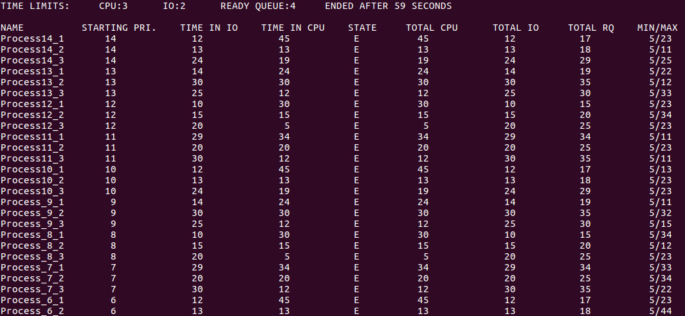

OS Scheduler Simulation
=======================

## John Harvey

### About
C program developed on Ubuntu to simulate a running operating system's scheduling of processes. The code is one process/thread only and the 'processes' are just data structures in the simulation. The simulation assumes one processor with one core. It assumes all user processes with kernel taking no time to do its work. Time will be the main loop one clock tick per iteration. One time through the loop - one clock tick. A custom priority queue is used.

### Install Notes - Ubuntu
1. Clone repo with git `git clone https://github.com/jharvey7136/scheduler.git`
2. Navigate to the app's root directory through terminal
3. Compile with command: `make`
4. Run program with command: `make run`
* Remove object files and executables: `make clean`

### Design
* Priorities should be 0-15 with 0 lowest and 15 highest.
* Priority queue algorithm adjusting priorities each time you add a process to the ready queue.
* Round Robin algorithm used so the process in the CPU is forced to leave when quantum time is up.
* 3 * 16 processes, 3 for each priority from 0-15.  One that is CPU bound, one that is even CPU and I/O and 1 that is I/O bound.  CPU bound must want more time than normally allowed in CPU before fast I/O spending most time in CPU.  I/O bound should stay in CPU much less time than normal CPU time and spend most time waiting for I/O.  Even should spend about the same amount of time in CPU as doing I/O.
* Data structures:

   A priority queue of processes ready for the CPU.  
     Each time click (one time around the main loop) you adjust priorities and move processes in this queue.  
   A list of processes waiting for I/O  
   A struct of OS parameters common to all processes  
     Max time in CPU before being bumped to ready queue if no I/O  
     Max wait time user processes in ready queue (try different times, how small can your scheduling algorithm handle?)
   
   Each process should keep track of at least the following information.  
     Name of process  
     Starting priority, reset current priority to this each time process moved into wait queue, does not change.  
     Current priority of the process which may change with aging.  
   Time in CPU needed before/between I/O (set once)  
   Time I/O takes (set once)  
   Total time in machine not counting time in wait queue (set at startup counts down).  How much time process spends doing something before it exits.  Sum of total time in CPU and total time in I/O.  
   Time in CPU currently.  Set to 0 when moved into CPU, when reaches A or quantum is up moves out of CPU.  
   Time left waiting for current I/O  
   Time process has been waiting in ready queue  
   Total time in CPU  
   Total time in I/O  
   Total time in ready queue  
   Smallest time in ready queue  
   Longest time in ready queue  
   
* Other Data:

   Current state of each process  

* Modules:

   Swap process in CPU  
   Add process to ready queue  

### Output

